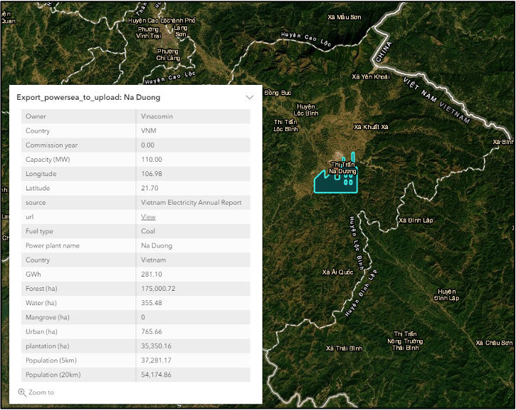
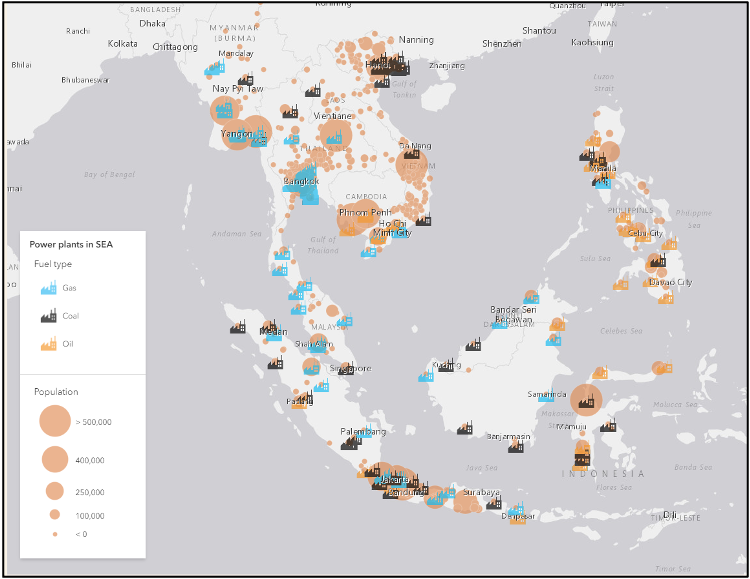

# ArcGIS_powerplants

## Data Source 

1. [Population Value derived from nighttime lights](https://developers.google.com/earth-engine/datasets/catalog/WorldPop_GP_100m_pop_age_sex_cons_unadj?hl=en)
2. [A global database of powerplants](https://www.wri.org/research/global-database-power-plants)
3. [Miettenen Vegetation layer 1990 - 2015](https://www.sciencedirect.com/science/article/pii/S2351989415300470)

## Spatial Analysis 

Differnet powerplants and their buffered properties within 30km 

More granular details 

